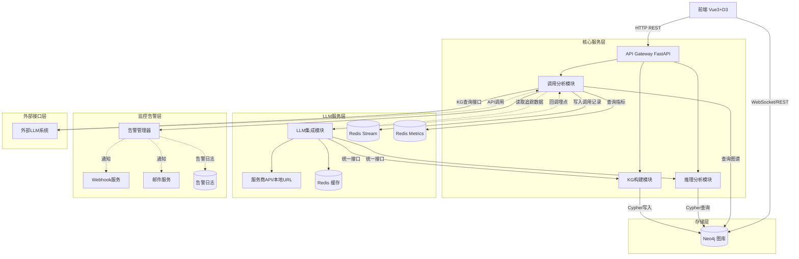

# Knowledge Graph System (Skeleton)

基于 LLM 的知识图谱构建与分析系统骨架。详细架构与设计见 [`设计与技术实现方案.md`](./设计与技术实现方案.md)。

## 当前状态

骨架阶段：核心链路（文本→LLM抽取→Neo4j 入库→子图查询）端到端可跑；推理、调用分析、告警、外部接口为占位。

#### 1.2 模块交互关系图



## 快速开始（Docker Compose）

```bash
cp .env.example .env
# 编辑 .env：填 OPENAI_API_KEY / ANTHROPIC_API_KEY、设置 NEO4J_PASSWORD / REDIS_PASSWORD / POSTGRES_PASSWORD
docker compose up -d
# 访问 http://localhost:8000/docs
```

## 本地开发（不用 Docker）

```bash
pip install -e ".[dev]"
# 自行启动本地 Neo4j 与 Redis，或用 docker compose up -d neo4j redis
uvicorn kg_system.main:app --reload
```

## 目录结构

| 路径 | 作用 |
|---|---|
| `src/kg_system/core/` | 配置、异常、模型、日志 |
| `src/kg_system/storage/` | Neo4j / Redis 客户端 + schema |
| `src/kg_system/llm/` | LLM 工厂、缓存、调用埋点 |
| `src/kg_system/builder/` | 文本→实体→关系→入库 pipeline |
| `src/kg_system/kg_query/` | 图谱查询服务 |
| `src/kg_system/reasoning/` | LangGraph 推理（占位） |
| `src/kg_system/analysis/` | 调用分析与告警（占位） |
| `src/kg_system/api/` | FastAPI 路由与中间件 |
| `prompts/` | LLM Prompt 模板 |
| `frontend/graphpanel.vue` | D3 子图可视化 |

## 实现状态

| 模块 | 状态 |
|---|---|
| `core/`、`storage/`、`llm/`、`builder/`、`kg_query/` | 可跑 |
| `api/v1/kg.py` (`/kg/build`, `/kg/query`) | 可跑 |
| `reasoning/`、`analysis/` | 占位（StateGraph 装配完整，节点/聚合 NotImplemented） |
| `api/v1/reason.py`、`analysis.py`、`external.py` | 注册路由，返回 501 |

## 下一步

详见 `docs/superpowers/specs/2026-05-28-kg-skeleton-design.md` §9（不在骨架范围）。每一项可独立立项。
