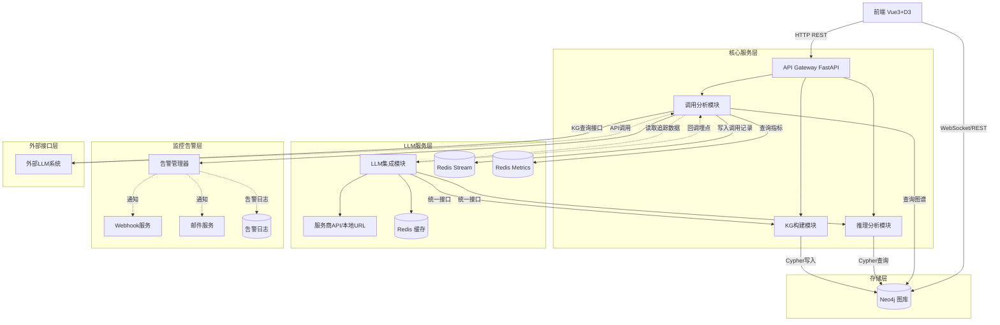

基于LLM的知识图谱构建与分析系统，是一个融合了大模型生成能力与图数据库结构化优势的复杂工程。采用模块化、低耦合的设计是确保系统可维护性和可扩展性的关键。

以下是该系统的详细设计与技术实现方案：

---

### 1. 系统总体架构设计

系统采用**微服务架构**与**模块化设计**，分为五大核心模块：数据接入层、核心处理层（构建与推理）、数据持久层、LLM基础服务层和前端展示层。

#### 1.1 模块划分与技术选型

* **API网关/接入层**: FastAPI (Python) - 提供RESTful API，处理认证鉴权、路由分发。
* **知识图谱构建模块**: LangChain + LLM - 负责文本解析、实体/关系/属性抽取、消歧对齐。
* **推理分析模块**: LangGraph + Neo4j - 负责多步推理图构建、状态机管理、子图检索与推理。
* **LLM集成模块**: LangChain Custom Callbacks + Redis - 统一LLM调用接口、缓存管理、调用分析。
* **存储模块**: Neo4j (图数据库) + Redis (缓存) + Postgres (业务数据)。
* **前端可视化**: Vue 3 + D3.js + `graphpanel.vue`。

#### 1.2 模块交互关系图



---

### 2. 知识图谱构建模块

#### 2.1 基于LLM的抽取流程

采用**分步抽取**策略（先实体后关系），降低LLM幻觉，提高抽取准确率。

1. **文本分块**: 将长文档按语义切分。
2. **实体抽取**: 识别文本中的核心实体及其类型。
3. **关系抽取**: 针对已识别的实体，抽取它们之间的关系及属性。
4. **实体消歧与合并**: 映射到图谱已有节点。

#### 2.2 Prompt设计策略

采用**结构化JSON输出**结合**少样本提示**。

* **实体抽取Prompt**:
  ```text
  你是一个知识图谱专家。请从以下文本中抽取核心实体。
  输出格式必须为JSON: {"entities": [{"name": "实体名", "type": "实体类型", "props": {"属性1": "值1"}}]}
  文本: {text}
  ```
* **关系抽取Prompt**:
  ```text
  给定实体列表 {entities} 和文本 {text}，请抽取实体间的关系。
  输出格式: {"relations": [{"head": "头实体", "tail": "尾实体", "relation": "关系类型", "props": {"时间": "..."}}]}
  ```

#### 2.3 LangChain链构建与消歧方案

使用LangChain的LCEL (LangChain Expression Language) 构建管道，结合Pydantic解析输出。

---

### 3. 知识图谱存储模块

#### 3.1 图数据库设计

采用**属性图模型**，保留灵活性。

* **节点类型**: `Entity` (通用实体节点)，通过 `type` 属性区分（如 Person, Org）。
* **关系类型**: `RELATED_TO` (通用关系)，通过 `relation_type` 属性区分具体语义。
* **属性设计**:
  * 节点: `id` (UUID), `name`, `type`, `description`, `source_doc`, `embedding` (向量)。
  * 关系: `id`, `relation_type`, `weight` (置信度), `properties` (动态属性)。

#### 3.2 索引优化方案

* **唯一性约束**: `CONSTRAINT FOR (e:Entity) REQUIRE e.name IS UNIQUE` (按type分组建联合唯一索引)。
* **全文索引**: `CREATE FULLTEXT INDEX entity_name_index FOR (e:Entity) ON EACH [e.name]` (用于模糊搜索消歧)。
* **向量索引**: `CREATE VECTOR INDEX entity_embedding_index FOR (e:Entity) ON (e.embedding)` (用于语义消歧)。

---

### 4. LLM集成模块

#### 4.1 统一接口设计

利用LangChain的 `BaseChatModel` 抽象，通过工厂模式动态实例化模型。

* **服务商API**: 直接使用 `ChatOpenAI`, `ChatAnthropic` 等。
* **本地URL**: 使用 `ChatOpenAI` 并配置 `base_url` 指向本地vLLM或llama.cpp服务。

#### 4.2 缓存策略

使用 **语义缓存**。在Redis中存储Query的Embedding与Response，新请求先在Redis中做向量Top-K检索，相似度大于0.95则直接返回。

---

### 5. 推理分析模块

#### 5.1 基于LangGraph的推理流程

将多步推理建模为**状态图**。

1. **Question**: 用户问题输入。
2. **Retrieve Subgraph**: 基于实体从Neo4j检索子图。
3. **Reason**: LLM基于子图进行逻辑推导。
4. **Decide**: 判断信息是否足够，足够则生成答案，不足则生成Cypher查询或拆解子问题。
5. **Execute Query**: 执行Cypher获取新子图，返回Step 3。

#### 5.2 LangGraph状态定义与图构建

**核心代码示例**:

```python
from langgraph.graph import StateGraph, END
from typing import TypedDict, Annotated, List

class ReasonerState(TypedDict):
    question: str
    subgraph: str
    reasoning_trace: List[str]
    answer: str
    next_action: str # "retrieve", "reason", "generate", "end"

def reason_node(state: ReasonerState):
    # 调用LLM基于subgraph推理
    prompt = f"基于子图: {state['subgraph']}, 回答问题: {state['question']}"
    # ... LLM调用逻辑
    return {"reasoning_trace": [...], "next_action": "generate"} # 或 "retrieve"

def retrieve_node(state: ReasonerState):
    # 查询Neo4j
    cypher = generate_cypher(state['question'])
    subgraph = neo4j_db.run(cypher)
    return {"subgraph": subgraph}

# 构建图
workflow = StateGraph(ReasonerState)
workflow.add_node("retrieve", retrieve_node)
workflow.add_node("reason", reason_node)

workflow.add_conditional_edges("reason", lambda state: state["next_action"], {
    "retrieve": "retrieve", "generate": END
})
workflow.add_edge("retrieve", "reason")
```

---

### 6. 大模型调用分析模块

#### 6.1 模块定位与功能概述

大模型调用分析模块是系统的"观测中心"，负责全面记录、统计和分析所有LLM调用行为。该模块通过统一拦截LLM调用链路，采集调用元数据，提供调用监控、性能分析、成本统计和能力评估等功能，为系统优化和业务决策提供数据支撑。

**核心功能矩阵**：

| 功能类别 | 具体功能 | 数据来源 |
| :------- | :------- | :------- |
| 调用监控 | 实时调用量统计、QPS监控、错误率追踪 | LLM集成模块回调 |
| 性能分析 | 响应延迟分布、首token耗时、流式输出速率 | 调用链路埋点 |
| 成本统计 | Token消耗计费、模型维度成本归因、预算告警 | 调用记录统计 |
| 能力评估 | 模型准确率评估、输出质量评分、幻觉率检测 | 结果采样分析 |

#### 6.2 数据采集机制

采用**无侵入式埋点**方案，通过LangChain的Callback机制在LLM调用生命周期各阶段自动采集数据。

**调用链路埋点设计**：

```
llm_call_events {
    event_id: UUID,                    # 事件唯一标识
    call_id: UUID,                     # 关联的LLM调用ID
    event_type: str,                   # on_llm_start | on_llm_end | on_llm_error
    timestamp: datetime,                # 事件发生时间
    duration_ms: int,                   # 耗时（仅end事件）
    input_tokens: int,                  # 输入Token数
    output_tokens: int,                 # 输出Token数
    model_name: str,                    # 调用的模型名称
    provider: str,                      # 服务商标识
    status: str,                        # success | error | timeout
    error_message: str,                 # 错误详情（若有）
    metadata: dict                      # 扩展元数据（调用来源、用户ID等）
}
```

#### 6.3 知识图谱接口服务

该模块提供标准化的知识图谱查询接口，供外部LLM或其他系统调用，实现知识资产的共享与复用。

**接口规范设计**：

```python
class KGQueryService:
    def __init__(self, neo4j_driver):
        self.driver = neo4j_driver

    def query_subgraph(self, entity_name: str, depth: int = 2, 
                       relation_types: List[str] = None) -> dict:
        """
        查询实体子图
        
        Args:
            entity_name: 目标实体名称
            depth: 查询深度（1-3）
            relation_types: 关系类型过滤（None表示全部）
        
        Returns:
            dict: 包含nodes和links的图结构数据
        """
    def get_entity_context(self, entity_name: str, max_neighbors: int = 10) -> str:
        """
        获取实体的语义上下文，用于增强LLM推理
        
        Args:
            entity_name: 实体名称
            max_neighbors: 最大邻居节点数
        
        Returns:
            str: 结构化的上下文描述文本
        """
```

**外部调用协议**：

| 接口路径 | 协议 | 认证方式 | 返回格式 | 调用频率限制 |
| :------- | :--- | :------- | :------- | :----------- |
| `/api/v1/kg/external/subgraph` | REST | API Key | JSON | 100/min |
| `/api/v1/kg/external/context` | REST | API Key | JSON | 200/min |
| `/api/v1/kg/external/cypher` | REST | API Key + 白名单 | JSON | 50/min |
| `/api/v1/kg/external/embed` | REST | API Key | JSON | 500/min |

#### 6.5 监控告警机制

基于Redis Stream构建实时告警系统，支持多级别告警和多种通知渠道。

```python
class AlertManager:
    ALERT_RULES = {
        "error_rate_high": {
            "condition": "error_rate > 0.05",
            "severity": "warning",
            "channels": ["log", "webhook"]
        },
        "response_time_slow": {
            "condition": "p99_duration > 10000",
            "severity": "warning",
            "channels": ["log", "webhook"]
        },
        "cost_over_budget": {
            "condition": "daily_cost > budget_limit",
            "severity": "critical",
            "channels": ["log", "webhook", "email"]
        },
        "service_down": {
            "condition": "success_rate < 0.5",
            "severity": "critical",
            "channels": ["log", "webhook", "email", "sms"]
        }
    }

```

#### 6.6 数据可视化与报表

提供Web仪表盘和API两种消费方式，满足运维监控和管理决策需求。

**Dashboard功能模块**：

1. **实时监控大屏**：展示QPS、响应时间、错误率等核心指标的实时变化
2. **模型对比分析**：横向对比不同模型的性能、成本和质量表现
3. **成本趋势分析**：按日/周/月维度统计Token消耗和费用趋势
4. **异常事件追溯**：记录并回放历史异常事件，支持问题定位

---

### 7. 前端可视化模块

#### 7.1 D3.js与graphpanel.vue实现

采用 **D3 Force-Directed Graph (力导向图)** 布局，适合网状知识图谱的探索。

* **布局算法**: `d3.forceSimulation` 配置 `forceLink`, `forceManyBody`, `forceCenter`。
* **视觉编码**:
  * **节点**: 圆形，`fill` 颜色映射实体类型，`r` 半径映射度数或重要性。
  * **关系**: 线段，`stroke-width` 映射关系权重，箭头表示方向。
* **交互功能**:
  * **缩放/平移**: `d3.zoom().on("zoom", ...)` 变换 `<g>` 容器。
  * **节点拖拽**: `d3.drag()` 重新固定节点位置。
  * **关系筛选**: Vue响应式变量控制边的 `display` 属性。

---

### 8. API接口设计

采用RESTful规范，统一响应格式：`{ "code": 200, "msg": "success", "data": {} }`。

| 接口路径                | 方法 | 功能         | 请求体                                   | 认证         |
| :---------------------- | :--- | :----------- | :--------------------------------------- | :----------- |
| `/api/v1/kg/build`    | POST | 异步构建图谱 | `{ "text": "...", "doc_id": "..." }`   | Bearer Token |
| `/api/v1/kg/query`    | POST | 查询子图     | `{ "entity_name": "...", "depth": 2 }` | Bearer Token |
| `/api/v1/reason/ask`  | POST | 推理问答     | `{ "question": "..." }`                | Bearer Token |
| `/api/v1/llm/analyze` | GET  | 获取调用统计 | `start_time`, `end_time`             | Admin Token  |

**错误处理**: 定义标准异常类 `KGException`，捕获后统一返回 `4xx/5xx` 及错误详情。

---

### 9. 数据流程设计

1. **输入**: 用户上传文本 -> API网关 -> **构建模块**。
2. **构建**: 文本 -> LangChain分块 -> LLM抽取(JSON) -> **消歧处理** -> 生成Cypher语句 -> 写入 **Neo4j**。
3. **推理**: 用户提问 -> **推理模块** -> 提取实体 -> Neo4j查询子图 -> LangGraph状态机流转 -> LLM多步推导 -> 生成答案与证据链。
4. **可视化**: 前端请求 `/api/v1/kg/query` -> 后端返回图JSON `{nodes: [], links: []}` -> D3.js渲染 `graphpanel.vue`。

---

### 10. 系统部署与扩展性

#### 10.1 部署方案

* **开发环境**: Docker Compose 一键启动。
* **生产环境**: Kubernetes (K8s) 集群部署。
  * FastAPI后端: Deployment (HPA自动扩缩容)。
  * Neo4j: StatefulSet (保障存储稳定) + 持久卷。
  * Redis: Sentinel模式高可用。

#### 10.2 扩展性考虑

* **水平扩展**: API服务无状态，可根据CPU/内存指标自动Pod扩容。Neo4j采用因果集群 读分离。
* **功能扩展预留**:
  * **多模态支持**: 在LLM集成模块增加Image Parser。
  * **图谱融合**: 在构建模块增加Schema对齐服务。
  * **Agent扩展**: LangGraph天然支持添加新的Tool Node，未来可轻松接入搜索引擎或代码执行工具。

### 技术可行性分析

1. **LangChain/LangGraph生态**: 目前已非常成熟，特别是结构化输出解析和状态机控制，完全满足构建和推理需求。
2. **Neo4j向量化支持**: Neo4j 5.x原生支持向量索引，使得语义消歧和相似度检索可以在库内完成，避免架构复杂化。
3. **本地大模型兼容性**: vLLM/Ollama均提供兼容OpenAI的API规范，通过LangChain的 `base_url` 覆写即可无缝接入，统一接口方案切实可行。
4. **前端D3.js渲染性能**: 对于万级节点，D3力导向布局可能出现卡顿。**优化建议**：在前端增加Web Worker计算布局，或后端预计算力导向坐标，前端仅做渲染；大规模图谱考虑使用WebGL渲染库（如PixiJS）替代SVG。

---

### 11. 环境变量配置方案

#### 11.1 配置管理原则

系统采用**环境变量优先**的配置管理模式，遵循12-Factor App方法论，确保应用在不同环境（开发、测试、生产）间的无缝迁移。

**配置优先级**（从高到低）：
1. 环境变量（`.env`文件）
2. 命令行参数
3. 配置文件（`config.yaml`）
4. 默认值

#### 11.2 环境变量文件结构

系统提供两个环境配置文件：

- **`.env.example`**：配置模板，包含所有可配置项及说明，**应提交至版本控制**
- **`.env`**：实际运行环境配置，包含敏感信息，**禁止提交至版本控制**

#### 11.3 配置分类

**基础配置**：应用名称、环境、调试模式、端口等

**LLM配置**：多服务商支持，通过 `LLM_DEFAULT_PROVIDER` 切换：
- OpenAI系列：`OPENAI_API_KEY`、`OPENAI_BASE_URL`、`OPENAI_MODEL`等
- Anthropic系列：`ANTHROPIC_API_KEY`、`ANTHROPIC_BASE_URL`等
- 本地部署：`LOCAL_LLM_BASE_URL`、`LOCAL_LLM_MODEL`等

**存储配置**：
- Neo4j：`NEO4J_URI`、`NEO4J_USER`、`NEO4J_PASSWORD`
- Redis：`REDIS_HOST`、`REDIS_PORT`、`REDIS_PASSWORD`
- Postgres（可选）：`POSTGRES_*`系列

**安全配置**：
- JWT认证：`JWT_SECRET_KEY`、`JWT_ALGORITHM`、`JWT_ACCESS_TOKEN_EXPIRE_MINUTES`
- API认证：`API_KEY_PREFIX`、`ADMIN_TOKEN`、`EXTERNAL_API_KEY`
- 外部访问：`EXTERNAL_API_IP_WHITELIST`

**业务配置**：
- 知识图谱构建：`TEXT_CHUNK_SIZE`、`ENTITY_TYPES`、`RELATION_TYPES`
- 推理分析：`REASONING_MAX_STEPS`、`REASONING_SUBGRAPH_DEPTH`
- 语义缓存：`SEMANTIC_CACHE_ENABLED`、`SEMANTIC_CACHE_SIMILARITY_THRESHOLD`

**监控告警配置**：
- 告警阈值：`ALERT_QPS_THRESHOLD`、`ALERT_ERROR_RATE_THRESHOLD`
- 通知渠道：`ALERT_WEBHOOK_URL`、`ALERT_EMAIL_ENABLED`
- 成本控制：`DAILY_BUDGET_USD`、`COST_*`模型单价